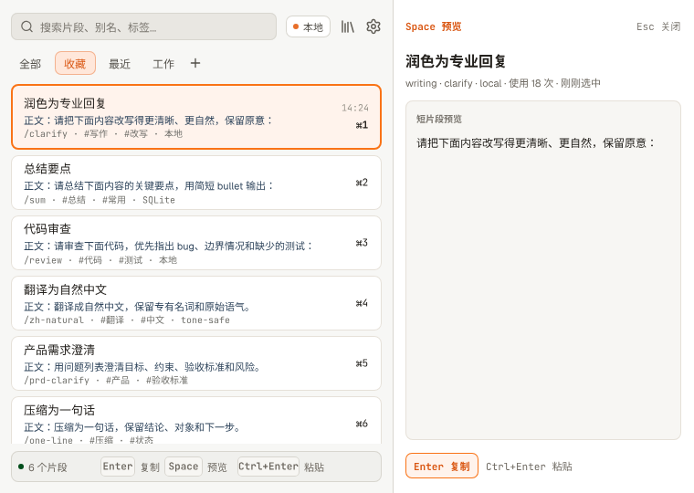
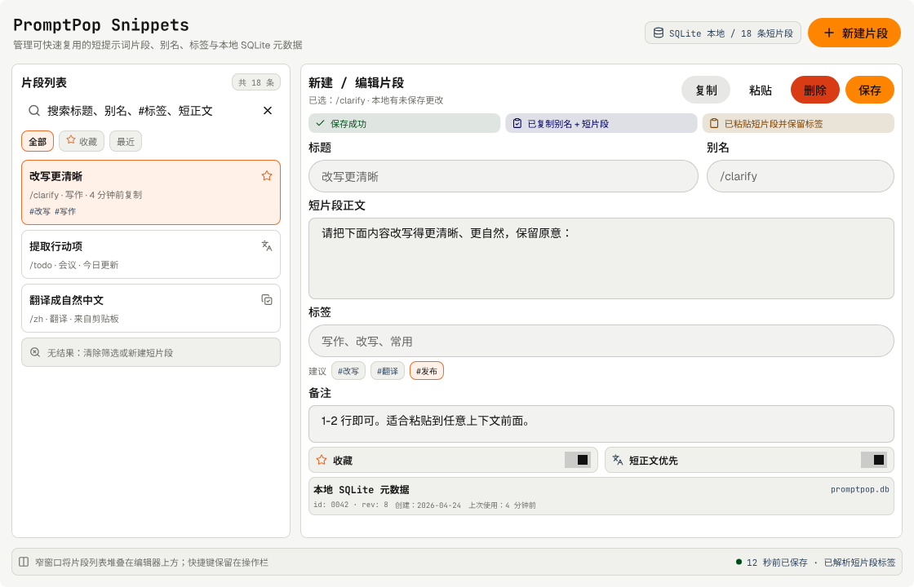
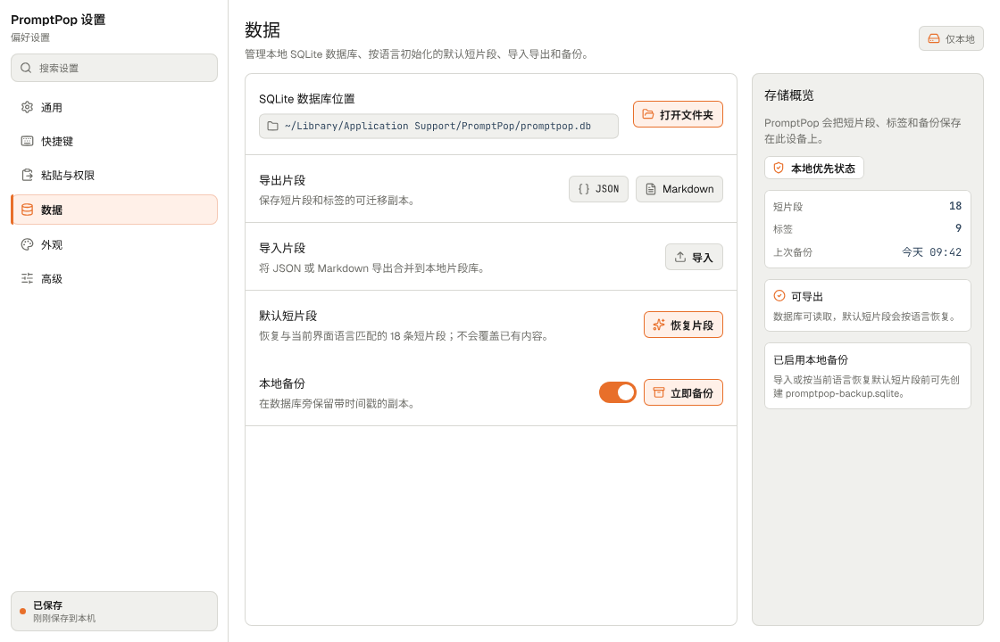
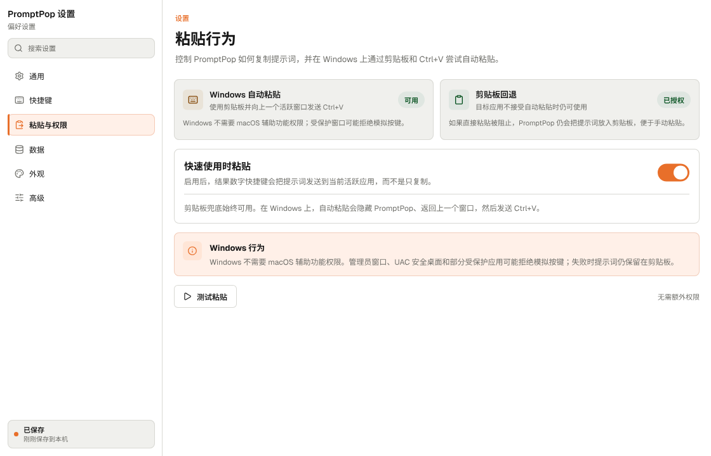

# PromptPop

PromptPop is a local-first desktop prompt launcher inspired by Raycast, Alfred,
and clipboard managers. It keeps reusable prompts one shortcut away, with fast
search, prompt management, clipboard copy, and optional paste automation.

> Status: early macOS-focused MVP.

## Screenshots

Screenshots are exported from the Pencil design source in
`design/PromptPop_0.0.1.pen`.



| Prompt library | Data settings |
| --- | --- |
|  |  |

| Windows paste behavior |
| --- |
|  |

## Features

- Save prompts with title, body, alias, notes, favorite flag, and tags.
- Search by title, alias, body, notes, and tags.
- Copy prompts to the clipboard or paste them into the active app.
- Open the launcher with a global shortcut.
- Keep PromptPop available from the macOS menu bar.
- Store prompts and settings locally in SQLite.
- Export prompts to JSON or Markdown and create local database backups.
- Use the browser fallback UI while developing without the desktop shell.

## Privacy Model

PromptPop is designed for local-first usage. Prompt content, settings, exports,
and backups stay on the user's device by default. The app does not include cloud
sync, telemetry, or external network calls.

Prompts can contain private workflows, client context, credentials, or internal
process knowledge. Treat exported prompt files, backups, and diagnostics as
sensitive.

## Platform Support

PromptPop publishes first-run installers for macOS and Windows:

- Windows x64 uses an NSIS `.exe` installer.
- macOS Apple Silicon and macOS Intel use separate `.dmg` installers.
- macOS launch at login writes a LaunchAgent.
- macOS auto paste uses System Events and requires Accessibility permission.
- Windows auto paste uses the clipboard and a native `Ctrl+V` send path.

Linux remains a future target.

## Signing and Notarization

Local development builds use ad-hoc signing (`signingIdentity = "-"`) because
the project does not ship with an Apple Developer certificate. This is enough
for local testing, but it is not a trusted public distribution path.

For public releases, maintainers should use an Apple Developer ID Application
certificate and notarize the app:

1. Enroll in the Apple Developer Program.
2. Create and install a Developer ID Application certificate in Keychain Access.
3. Set `bundle.macOS.signingIdentity` in `src-tauri/tauri.conf.json` to the
   certificate identity, or provide the equivalent Tauri signing environment.
4. Configure notarization credentials through either:
   - `APPLE_ID`, `APPLE_PASSWORD`, and `APPLE_TEAM_ID`, or
   - `APPLE_API_KEY`, `APPLE_API_ISSUER`, and `APPLE_API_KEY_PATH`.
5. Build from a normal, non-sandboxed macOS shell:

   ```sh
   npm run tauri:build:dmg
   ```

The current Windows installers are not code-signed yet. Unsigned or ad-hoc
signed artifacts are suitable for contributors and early testing only. If macOS
Gatekeeper blocks a local build, rebuild it locally or use a properly signed and
notarized release.

## Requirements

- Node.js 20 or newer
- npm
- Rust stable
- macOS or Windows for the full Tauri desktop workflow

## Development

Install dependencies:

```sh
npm install
```

Run the web UI:

```sh
npm run dev
```

Run the desktop app:

```sh
npm run tauri:dev
```

Run checks and tests:

```sh
npm run verify
```

Build a macOS `.app` bundle:

```sh
npm run tauri:build:app
```

Build all configured Tauri bundles:

```sh
npm run tauri:build
```

Build a DMG release package from a normal, non-sandboxed macOS shell:

```sh
npm run tauri:build:dmg
```

Build a Windows NSIS installer from a normal Windows shell:

```sh
npm run tauri:build:windows
```

Note: DMG creation uses macOS `hdiutil` and Finder automation. It may fail in
sandboxed terminals even when the `.app` bundle builds correctly.

## Release

Pushing a version tag such as `v0.0.1` runs the release workflow. The workflow
creates a draft GitHub Release, builds the Windows x64 NSIS installer plus macOS
Apple Silicon and Intel DMGs, uploads them as release assets, then publishes the
release after all installers build successfully.

## Data Locations

PromptPop stores its SQLite database in the Tauri app data directory. The
settings screen shows the exact database, logs, exports, and backups paths for
the current machine.

Exports and backups are user-created files and may contain private prompt data.

## Repository Layout

- `src/` - Svelte and TypeScript frontend.
- `src-tauri/` - Tauri 2, Rust commands, SQLite persistence, tray, shortcuts,
  clipboard, and packaging config.
- `docs/` - product and design notes.
- `design/` - source visual assets used to generate app and tray icons.

## Verification

The standard local verification suite is:

```sh
npm run verify
```

It runs:

- `npm run check`
- `npm run build`
- `cargo test --manifest-path src-tauri/Cargo.toml`

GitHub Actions runs the same suite and builds the macOS `.app` bundle.

## Contributing

See [CONTRIBUTING.md](CONTRIBUTING.md).

## Repository

The public repository is <https://github.com/mucwj/PromptPop>.

## Security

See [SECURITY.md](SECURITY.md).

## License

PromptPop is released under the [MIT License](LICENSE).
